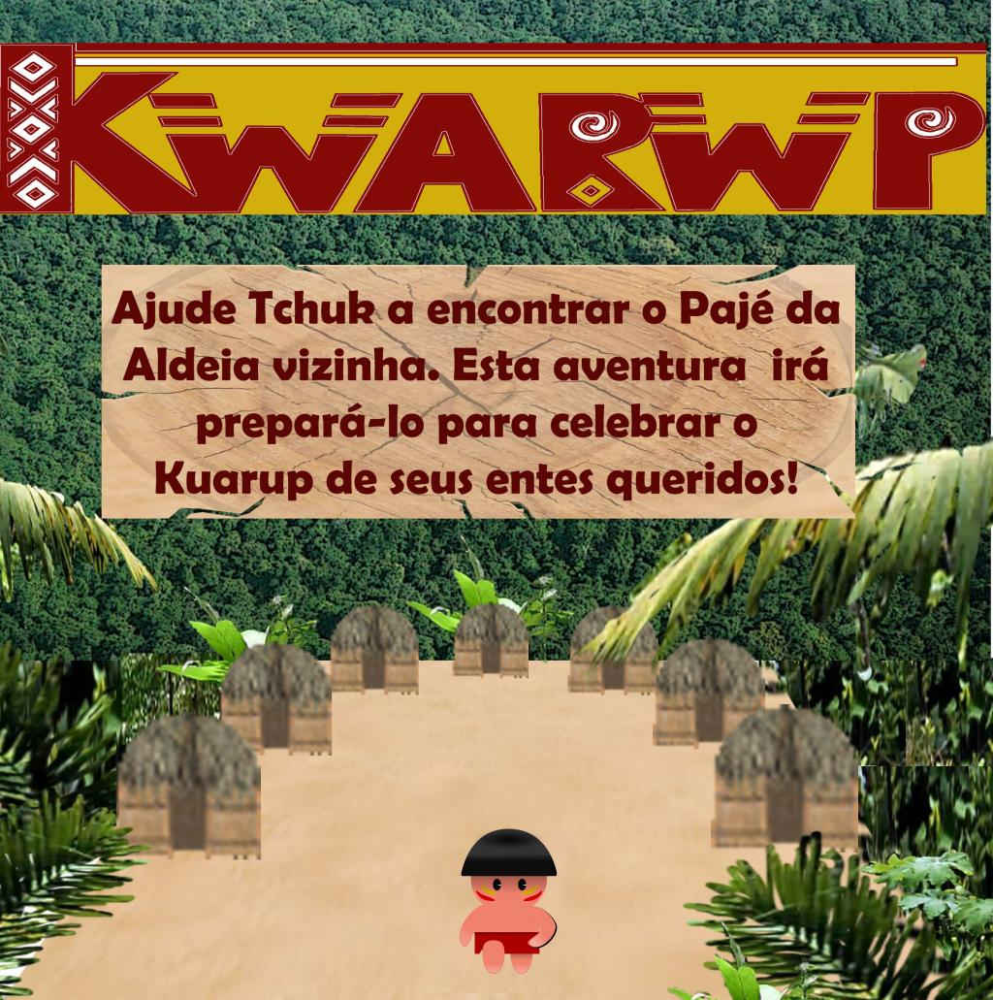

.. Kwarwp documentation master file, created by
   sphinx-quickstart on Mon Jul 27 10:30:56 2020.
   You can adapt this file completely to your liking, but it should at least
   contain the root `toctree` directive.

Manual Kwarwp 
=============
 |Kwarwp|

Jogo para aprendizado de programação.

 |docs| |python| |github| |licencing|

:Author:  Carlo E. T. Oliveira
:Affiliation: Universidade Federal do Rio de Janeiro
:Homepage: `Projeto Kwarwp`_

Descrição
------------

Um jogo de aventura que se joga aprendendo e criando programas na linguagem Python.

Este ambiente facilita a aprendizagem da linguagem Python.

O jogo é dirigido principalmente ao ensino de programação de computadores para jovens e crianças do ensino médio e fundamental.

Documentação
------------

.. toctree::
   :maxdepth: 2
   :caption: Contents:
   
   modules.rst

.. _Projeto Kwarwp: http://activufrj.nce.ufrj.br/wiki/labase/Projeto_Kwarwp

.. |licencing| image:: https://img.shields.io/github/license/kwarwp/kwarwp
   :target: https://github.com/kwarwp/kwarwp/blob/master/LICENSE

.. |github| image:: https://img.shields.io/github/v/release/kwarwp/kwarwp
   :target: https://github.com/kwarwp/kwarwp/releases/

.. |python| image:: https://img.shields.io/github/languages/top/kwarwp/kwarwp
   :target: https://www.python.org/downloads/release/python-383/

.. |docs| image:: https://img.shields.io/readthedocs/supygirls
   :target: https://supygirls.readthedocs.io/en/latest/index.html

.. |licence| image:: https://img.shields.io/github/license/kwarwp/kwarwp
   :target: https://github.com/kwarwp/kwarwp/blob/master/LICENSE

Indices and tables
==================

* :ref:`genindex`
* :ref:`modindex`
* :ref:`search`
